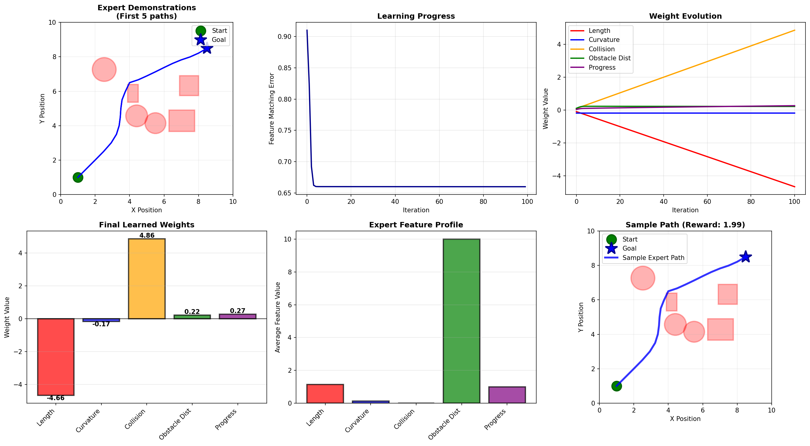

# Grid Navigation using Maximum Entropy IRL

Learns to navigate a 2D grid world with obstacles by recovering a reward function from expert demonstrations without being told what the reward is.

This is an implementation of **Maximum Entropy Inverse Reinforcement Learning (MaxEnt IRL)**, where an agent observes expert paths and figures out *why* they're good, then uses that learned reward to navigate on its own.



## What it does

1. **Generates a random world** — a 10×10 grid with circular and rectangular obstacles
2. **Creates expert demonstrations** — an A* planner finds 10 optimal paths from start to goal
3. **Learns a reward function** — using MaxEnt IRL with soft value iteration and entropy-regularized Bellman updates
4. **Achieves 47% reduction in feature matching error** over 100 training iterations

The agent learns to weigh 5 interpretable features:
- Path length (shorter is better)
- Curvature (smoother is better)
- Collision count (avoid obstacles)
- Distance to obstacles (stay clear)
- Progress toward goal (keep moving forward)


## How to run

```bash
pip install numpy matplotlib
python MaxEnt_GridPath.py
```

Output is saved to `learned_navigation.png` and printed to console.

---

## Results

After 100 iterations the model converges on a reward function that correctly identifies:
- **Goal progress** and **obstacle avoidance** as strongly encouraged behaviors
- **Collisions** and **unnecessary curvature** as strongly penalized behaviors

Training curve, weight evolution, and final learned weights are all visualized in the output figure.

---

## Key concepts

| Concept | Implementation |
|---|---|
| Soft value iteration | Entropy-regularized Bellman updates |
| Expert feature matching | State visitation frequency comparison |
| Reward parameterization | Linear combination of 5 interpretable features |
| Path planning | A* with grid resolution 0.5, 8-directional movement |

---

## Project structure

```
├── MaxEnt_GridPath.py       # All code: world, expert, reward learner
├── learned_navigation.png   # Output visualization
└── README.md
```

---

## Background

Inverse Reinforcement Learning (IRL) solves the problem of learning behavior from demonstrations when the reward function is unknown. MaxEnt IRL (Ziebart et al., 2008) resolves ambiguity in expert behavior by assuming the expert acts to maximize entropy subject to matching feature expectations.

---


